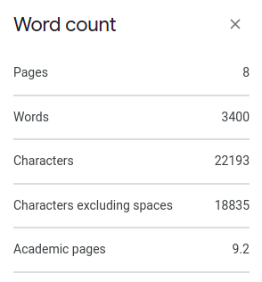

# Google Docs academic pages count

Adds the number of academic pages (2400 characters including spaces) to the word count dialogue.

## Flaticon attribution

Icons made by <a href="https://www.flaticon.com/authors/smalllikeart" title="smalllikeart">smalllikeart</a> from <a href="https://www.flaticon.com/" title="Flaticon">www.flaticon.com</a>

